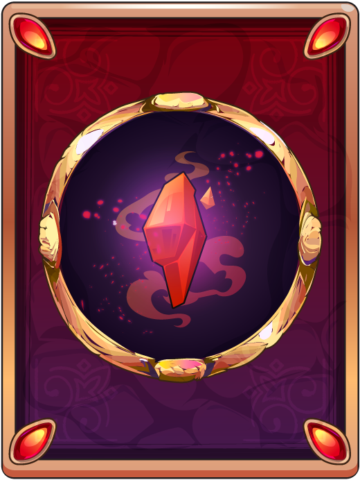
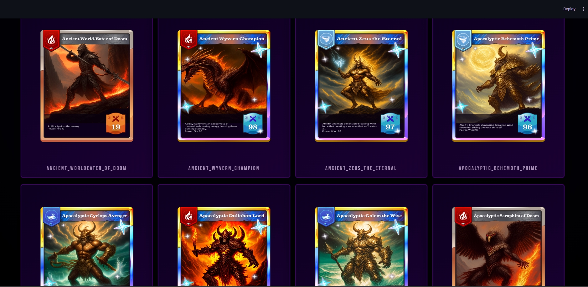

# 🎴 AI Fantasy Card Generator (The New Return)


[🇺🇸 English Description](#-english-description) | [🇹🇭 คำอธิบายภาษาไทย](#-คำอธิบายภาษาไทย)

---

## 🇺🇸 English Description

**AI Fantasy Card Generator** is an interactive web application that combines the thrill of **Gacha mechanics** with the power of **Generative AI**. This project allows users to open card packs, customize character classes, and generate unique, one-of-a-kind fantasy cards in real-time using the **Kandinsky 2.2** model.

### ✨ Key Features
* **🤖 Real-time AI Generation:** Generates high-quality fantasy character images on the fly based on user selection (Class & Weapon).
* **📦 Gacha System:** Simulates the excitement of opening card packs with different rarity levels (Bronze, Silver, Gold, Diamond).
* **⚔️ Customization:** Users can choose specific classes (e.g., Swordman, Mage) and weapons to influence the AI generation.
* **🎲 3D Interactive Viewer:** Features a stunning 3D card flip animation and 360-degree rotation using CSS3 & JavaScript.
* **🗂️ Deck Gallery:** A dedicated Streamlit dashboard to view, manage, and inspect your collected cards with 3D preview.
* **⚡ Hardware Acceleration:** Supports CUDA for faster generation on NVIDIA GPUs (with automatic CPU fallback).

### 🛠️ Tech Stack
* **Backend:** Python, Flask
* **Frontend:** HTML5, CSS3 (Advanced Animations), JavaScript (jQuery), Streamlit
* **AI/ML:** PyTorch, Kandinsky 2.2 (Text-to-Image), Diffusers
* **Tools:** Ngrok (for testing), Git

---

## 🇹🇭 คำอธิบายภาษาไทย

**AI Fantasy Card Generator** คือโปรเจคเว็บแอปพลิเคชันที่ผสมผสานความสนุกของระบบ **กาชา (Gacha)** เข้ากับเทคโนโลยี **Generative AI** ผู้เล่นสามารถเลือกเปิดซองการ์ด และให้ AI วาดรูปตัวละครแฟนตาซีขึ้นมาใหม่แบบสดๆ (Real-time) ตามอาชีพและอาวุธที่กำหนด โดยใช้โมเดล **Kandinsky 2.2**

### ✨ ฟีเจอร์หลัก
* **🤖 เจนรูปด้วย AI สดๆ:** สร้างรูปตัวละครที่ไม่ซ้ำกันเลยในโลก ตาม Class และอาวุธที่ผู้เล่นเลือก
* **📦 ระบบเปิดซองกาชา:** จำลองการเปิดซองการ์ดที่มีระดับความหายากต่างกัน (Bronze, Silver, Gold, Diamond)
* **⚔️ ระบบปรับแต่ง:** เลือกอาชีพ (เช่น นักดาบ, นักเวทย์) และอาวุธเพื่อให้ AI สร้างภาพได้ตรงใจ
* **🎲 มุมมองการ์ด 3 มิติ:** ระบบแสดงผลการ์ดแบบ 3D ที่สามารถหมุนดูได้ 360 องศา พร้อมเอฟเฟกต์แสงเงาสมจริง
* **🗂️ คลังเก็บการ์ด (Deck):** หน้า Dashboard (ทำด้วย Streamlit) สำหรับดูคอลเลกชันการ์ดทั้งหมดที่เปิดได้
* **⚡ รองรับการ์ดจอแยก:** ระบบตรวจสอบและใช้งาน GPU (CUDA) อัตโนมัติ เพื่อความรวดเร็วในการเจนภาพ

### 🛠️ เทคโนโลยีที่ใช้
* **Backend:** Python, Flask
* **Frontend:** HTML5, CSS3 (Animation จัดเต็ม), JavaScript, Streamlit
* **AI/ML:** PyTorch, Kandinsky 2.2, Diffusers
* **Tools:** Ngrok, Git

---

## 🚀 Installation & Setup

1.  **Clone the repository**
    ```bash
    git clone [https://github.com/your-username/your-repo-name.git](https://github.com/your-username/your-repo-name.git)
    cd your-repo-name
    ```

2.  **Install dependencies**
    ```bash
    pip install -r requirements.txt
    ```
    *(Note: For GPU support, ensure you have the correct PyTorch CUDA version installed.)*

3.  **Run the Game (Flask)**
    ```bash
    python app.py
    ```
    The game will start at `http://127.0.0.1:5000`

4.  **Run the Deck Viewer (Streamlit)**
    ```bash
    python -m streamlit run app_deck.py
    ```
    The gallery will start at `http://localhost:8501`

---

## 📸 Screenshots

*(Place your screenshots here / ใส่รูปตัวอย่างโปรเจคตรงนี้)*
| Gacha Opening | 3D Card Viewer | Deck Gallery |
|:---:|:---:|:---:|
|  |  |  |

---

## 👨‍💻 Author

**[Your Name / ชื่อของคุณ]**
* GitHub: [YourProfile]((https://github.com/BOXiandMaxi))
* Email: keattisaksari@gmail.com
